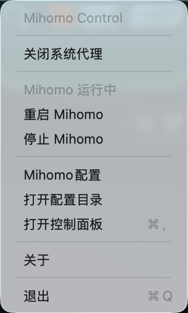
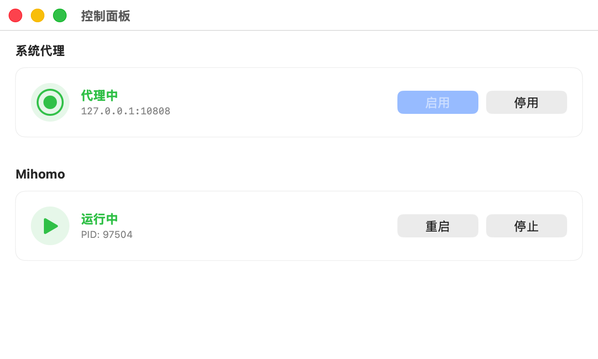
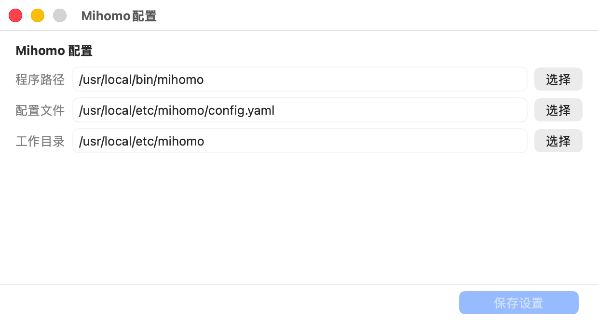
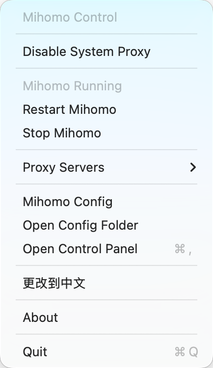
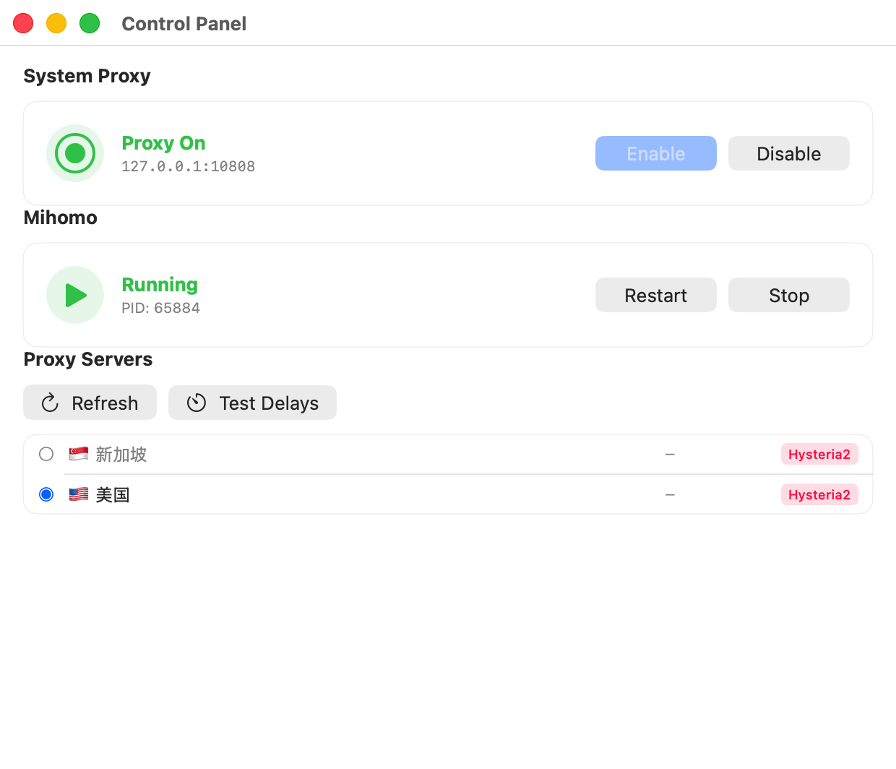
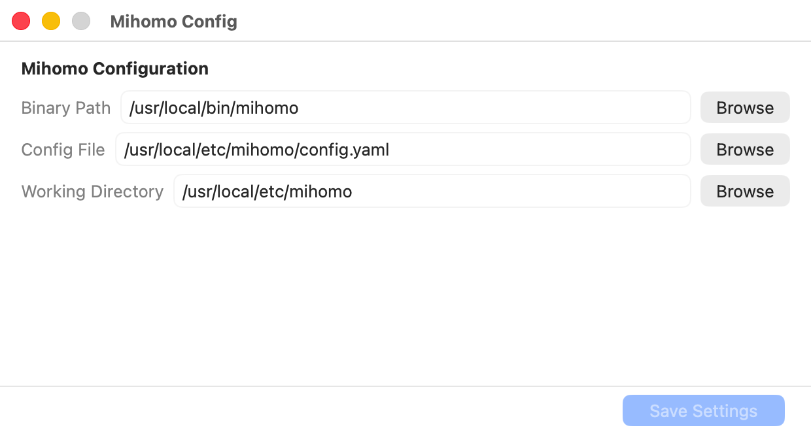

# AJMihomoControl

> 🌐 [English](#english) | [中文](#中文)

---

<a id="中文"></a>

## 🇨🇳 中文

**当前版本：1.1.1**

macOS 菜单栏应用，直接控制系统代理设置并与 mihomo 代理核心集成。

### 功能

- 🌐 **系统代理控制** — 一键开关 macOS 系统代理（HTTP/HTTPS/SOCKS）
- 🔌 **mihomo 集成** — 自动启动 mihomo，管理进程生命周期
- 🖥️ **代理服务器切换** — 通过 mihomo API 快速切换代理节点，支持延迟测试
- 📊 **状态栏图标** — 代理开启/关闭时实时切换图标
- 📋 **右键菜单** — 快速切换代理服务器，无需打开控制面板
- ⚙️ **配置窗口** — 管理 mihomo 二进制路径、配置文件和工作目录

### 环境要求

- macOS 14.0 (Sonoma) 或更高版本
- Swift 5.9+
- [mihomo](https://github.com/MetaCubeX/mihomo)（通过 Homebrew 或手动安装）

### 快速开始

**1. 安装 mihomo**

```bash
brew install mihomo
```

**2. 从源码构建**

```bash
git clone https://github.com/xujun/AJMihomoControl.git
cd AJMihomoControl
make build
```

**3. 运行**

```bash
make run
```

**4. 安装到 Applications**

```bash
make install
```

### 构建命令

| 命令 | 说明 |
|------|------|
| `make build` | 构建 .app 文件 |
| `make run` | 构建并运行 |
| `make install` | 构建并安装到 /Applications |
| `make release` | 构建发布包 (zip) |
| `make dmg` | 创建 DMG 安装镜像（拖拽安装） |
| `make clean` | 清理构建产物 |

### 项目结构

```
AJMihomoControl/
├── Package.swift              # Swift Package 定义
├── Info.plist                 # 应用配置
├── AppIcon.icns               # 应用图标
├── Makefile                   # 构建脚本
├── LICENSE                    # MIT 许可证
├── README.md                  # 本文件
├── .gitignore                 # Git 忽略规则
└── Sources/
    ├── AppDelegate.swift      # 应用入口、菜单栏、窗口管理
    ├── AppConfig.swift        # 配置持久化 (UserDefaults)
    ├── ProxyManager.swift     # 系统代理控制 (networksetup)
    ├── MihomoManager.swift    # mihomo 进程管理
    ├── MihomoAPI.swift        # mihomo RESTful API 客户端
    ├── SettingsView.swift     # SwiftUI 视图（控制面板 + 配置）
    ├── ProxySwitcherView.swift # 代理服务器切换界面
    └── L10n.swift             # 本地化字符串（中/英）
```

### 使用方式

**菜单栏**
- **左键点击** 状态栏图标 → 打开控制面板
- **右键点击** 状态栏图标 → 快捷操作菜单（含代理服务器切换）



**控制面板**
- 启用/停用系统代理
- 启动/停止/重启 mihomo 服务
- 启用代理时自动启动 mihomo（如未运行）
- 停止 mihomo 时自动停用系统代理
- 查看代理服务器列表，点击切换节点
- 测试所有代理服务器延迟



**代理服务器切换**
- 自动从 mihomo 获取可用代理节点
- 自动读取 mihomo 配置中的 API 密钥
- 点击节点即可切换当前代理
- 支持一键测试所有节点延迟
- 右键菜单可快速切换（无需打开控制面板）

**Mihomo 配置**
- 配置二进制路径（自动检测 Homebrew 安装）
- 设置配置文件路径（默认：`/usr/local/etc/mihomo/config.yaml`）
- 设置工作目录
- 配置 API 密钥（可选，默认从 mihomo 配置自动读取）



### 工作原理

应用使用 macOS 内置的 `networksetup` 命令管理系统代理设置，等同于在 **系统设置 → 网络 → 代理** 中手动配置。

启用时配置：
- HTTP 代理 → `127.0.0.1:<端口>`
- HTTPS 代理 → `127.0.0.1:<端口>`
- SOCKS 代理 → `127.0.0.1:<端口>`

**代理服务器切换** 通过 mihomo 的 RESTful API（默认 `http://127.0.0.1:9090`）实现：
- 自动从 mihomo 配置读取 API 密钥（`secret` 字段）
- 获取所有可用代理节点（过滤掉系统代理如 DIRECT、REJECT 等）
- 通过 API 切换当前选中的代理
- 测试代理延迟（`GET /proxies/:name/delay`）

---

<a id="english"></a>

## 🇺🇸 English

**Current Version: 1.1.1**

macOS menu bar app for controlling system proxy settings with mihomo.

### Features

- 🌐 **System Proxy Control** — One-click toggle for macOS system proxy (HTTP/HTTPS/SOCKS)
- 🔌 **mihomo Integration** — Auto-start mihomo, manage process lifecycle
- 🖥️ **Proxy Server Switching** — Quickly switch proxy nodes via mihomo API, with latency testing
- 📊 **Status Bar Indicator** — Real-time icon change when proxy is enabled/disabled
- 📋 **Right-click Menu** — Quick proxy server switching without opening the control panel
- ⚙️ **Configuration Window** — Manage mihomo binary, config, and working directory paths

### Requirements

- macOS 14.0 (Sonoma) or later
- Swift 5.9+
- [mihomo](https://github.com/MetaCubeX/mihomo) (installed via Homebrew or manually)

### Quick Start

**1. Install mihomo**

```bash
brew install mihomo
```

**2. Build from Source**

```bash
git clone https://github.com/xujun/AJMihomoControl.git
cd AJMihomoControl
make build
```

**3. Run**

```bash
make run
```

**4. Install to Applications**

```bash
make install
```

### Build Targets

| Command | Description |
|---------|-------------|
| `make build` | Build the app bundle |
| `make run` | Build and launch the app |
| `make install` | Build and install to /Applications |
| `make release` | Build release package (zip) |
| `make dmg` | Create DMG installer (drag-to-install) |
| `make clean` | Remove build artifacts |

### Project Structure

```
AJMihomoControl/
├── Package.swift              # Swift Package definition
├── Info.plist                 # App bundle configuration
├── AppIcon.icns               # App icon
├── Makefile                   # Build targets
├── LICENSE                    # MIT License
├── README.md                  # This file
├── .gitignore                 # Git ignore rules
└── Sources/
    ├── AppDelegate.swift      # App entry point, menu bar, window management
    ├── AppConfig.swift        # Configuration (UserDefaults persistence)
    ├── ProxyManager.swift     # System proxy control via networksetup
    ├── MihomoManager.swift    # mihomo process lifecycle
    ├── MihomoAPI.swift        # mihomo RESTful API client
    ├── SettingsView.swift     # SwiftUI views for control panel & config
    ├── ProxySwitcherView.swift # Proxy server switching interface
    └── L10n.swift             # Localization strings (Chinese/English)
```

### Usage

**Menu Bar**
- **Left-click** status bar icon → Open Control Panel
- **Right-click** status bar icon → Quick actions menu (with proxy server switching)



**Control Panel**
- Enable/Disable system proxy
- Start/Stop/Restart mihomo service
- Enable proxy auto-starts mihomo if not running
- Stop mihomo auto-disables system proxy
- View proxy server list, click to switch nodes
- Test latency for all proxy servers



**Proxy Server Switching**
- Automatically fetches available proxy nodes from mihomo
- Automatically reads API secret from mihomo config
- Click a node to switch the current proxy
- One-click latency test for all nodes
- Quick switch via right-click menu (no need to open control panel)

**Mihomo Config**
- Configure binary path (auto-detected for Homebrew)
- Set config file path (default: `/usr/local/etc/mihomo/config.yaml`)
- Set working directory
- Configure API secret (optional, auto-read from mihomo config by default)



### How It Works

The app uses macOS's built-in `networksetup` command to manage system proxy settings, equivalent to manually configuring in **System Settings → Network → Proxy**.

When enabled, it configures:
- HTTP Proxy → `127.0.0.1:<port>`
- HTTPS Proxy → `127.0.0.1:<port>`
- SOCKS Proxy → `127.0.0.1:<port>`

**Proxy Server Switching** is implemented via mihomo's RESTful API (default `http://127.0.0.1:9090`):
- Automatically reads API secret from mihomo config (`secret` field)
- Fetches all available proxy nodes (filters out system proxies like DIRECT, REJECT, etc.)
- Switches the current proxy via API
- Tests proxy latency (`GET /proxies/:name/delay`)

---

## License / 许可

MIT. See [LICENSE](LICENSE) for details.

---

## Author / 作者

- GitHub: [xujun](https://github.com/xujun)
- Email: 5798473@qq.com
